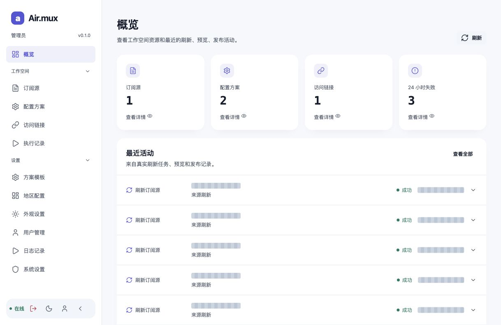
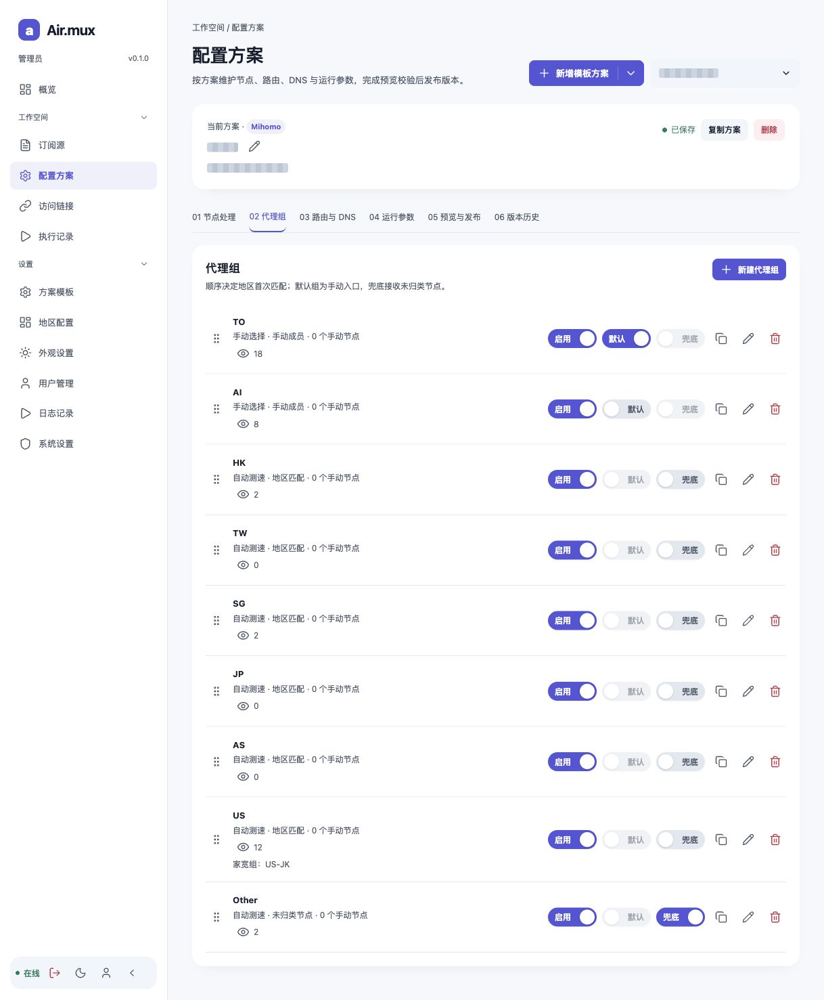
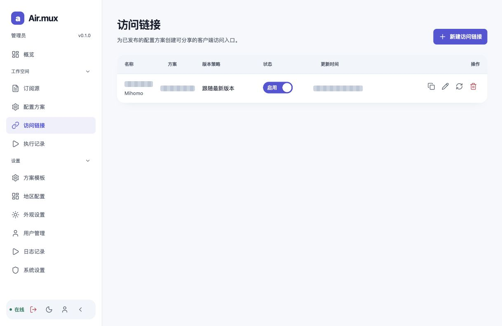

# Airmux RS

[简体中文](README.md) · **English**

Airmux RS is a configuration workspace for managing subscription sources, configuration plans, published versions, and client access links.

**Rust API · Vue 3 · PostgreSQL · Docker / linux/amd64**

[Download](https://github.com/jilinker/airmux-rs-public/releases/latest) · [Deployment guide](docs/DEPLOYMENT.md)

Source code is maintained privately. This public repository distributes deployment documentation, redacted screenshots, and release metadata.

## Installation and updates

Deployment needs **three files and three steps**, with Docker and the Compose plugin installed.

1. Download [config.yaml](https://raw.githubusercontent.com/jilinker/airmux-rs-public/main/config.yaml) and [compose.yaml](https://raw.githubusercontent.com/jilinker/airmux-rs-public/main/compose.yaml) into `/srv/airmux`. Edit the administrator credentials, database password, encryption key, update token, and access origins.
2. Download [.env](https://raw.githubusercontent.com/jilinker/airmux-rs-public/main/.env), set the same database password, and change the image, port, or directory only if needed. Run:

   ```sh
   cd /srv/airmux
   chmod 600 config.yaml .env
   docker compose up -d --wait
   ```

3. Run `docker compose ps` and `docker compose logs --tail=50 api`, then verify login at `http://SERVER_IP:8080`.

Rust startup handles database creation, migrations, and the first administrator automatically. No repository clone, Python installation, or management script is needed. See the [English deployment guide](docs/DEPLOYMENT.md) · [中文部署指南](docs/DEPLOYMENT.zh-CN.md) for the settings to edit.

## Features

Manage subscription sources and nodes, configuration plans and templates, routing and DNS, redacted previews and publications, client access links, and system updates.

## Screenshots






